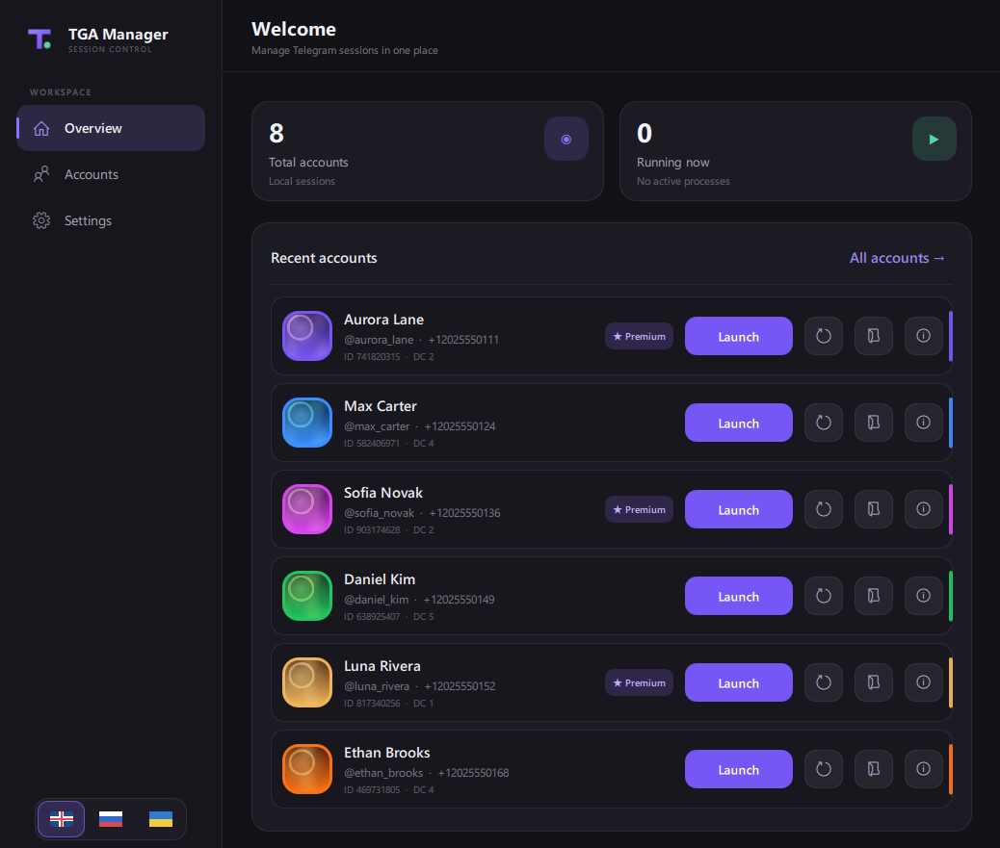
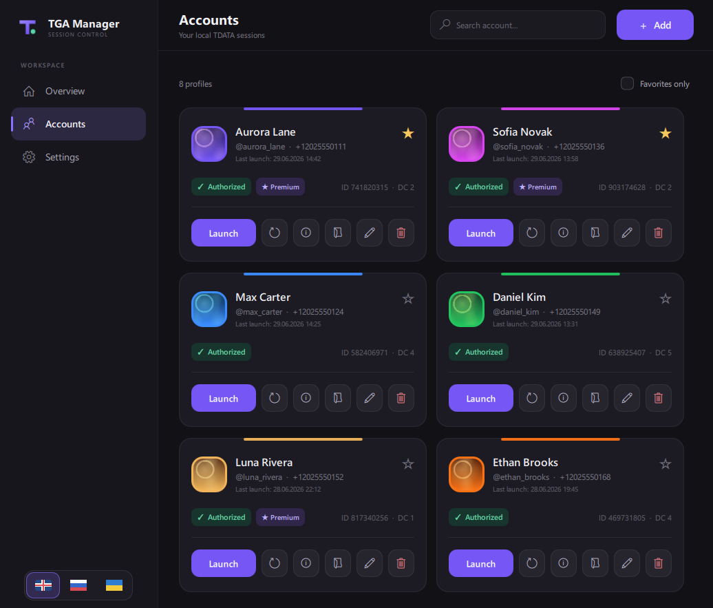
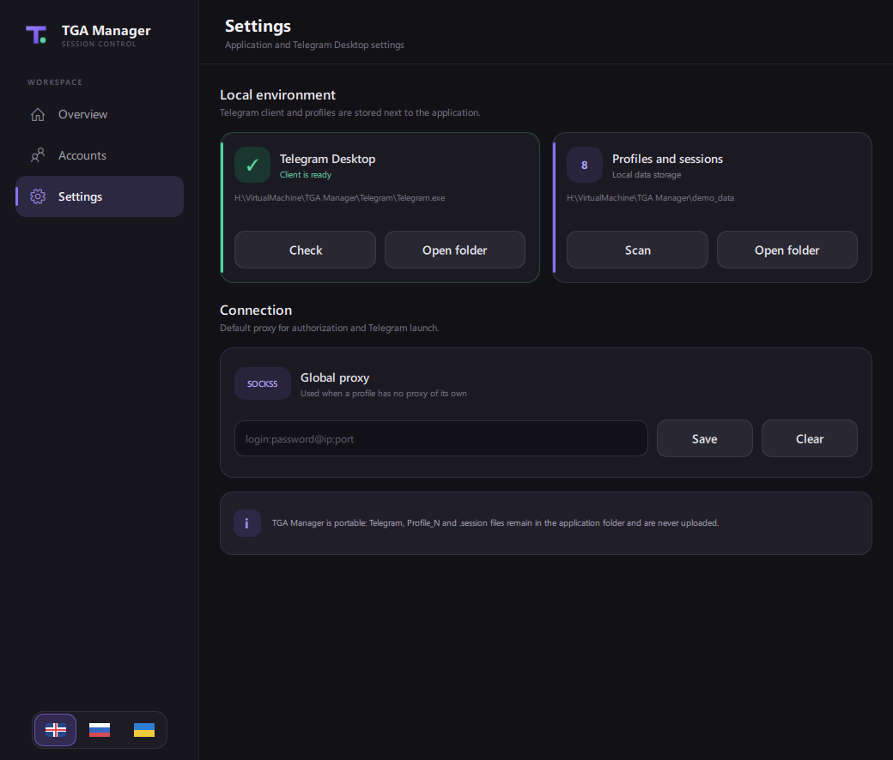

<p align="center">
  
</p>

<h1 align="center">TGA Manager</h1>

<p align="center">
  Локальный менеджер аккаунтов Telegram Desktop.
</p>

<p align="center">
  
  
  
  
</p>

TGA Manager хранит профили рядом с приложением и запускает отдельный экземпляр portable Telegram Desktop с нужной папкой `tdata`. Интерфейс написан на PySide6 и QML, поддерживает русский, украинский и английский языки.

> [!IMPORTANT]
> Приложение предназначено для управления собственными аккаунтами. Файлы `tdata` и `.session` дают доступ к Telegram-аккаунту — не публикуйте и не передавайте их другим людям :).

## Скриншоты







Показанные на скриншотах аккаунты и идентификаторы являются вымышленными.

## Возможности

- запуск нескольких независимых Telegram Desktop через `-many -workdir`;
- импорт существующей `tdata` в локальные папки `data/Profile_N`;
- ручная авторизация в отдельном экземпляре Telegram;
- создание совместимых сессий Telethon и Pyrogram;
- получение имени, username, телефона, Telegram ID, DC, Premium-статуса и аватара;
- поиск, избранное, заметки и цветовые метки профилей;
- запуск и закрытие Telegram непосредственно из карточки аккаунта;
- глобальный или отдельный SOCKS5-прокси в формате `login:password@ip:port`;
- импорт ZIP, TAR, 7Z и RAR с папкой `tdata` через Drag & Drop;
- автоматическое обнаружение новых профилей в папке `data`;
- загрузка последней официальной portable x64-версии Telegram Desktop;
- тёмный адаптивный интерфейс;
- русский, украинский и английский интерфейс.

## Быстрая установка

Подробное руководство: [docs/INSTALLATION.md](docs/INSTALLATION.md).

### Автоматически — рекомендуется

1. Скачайте репозиторий через **Code → Download ZIP** и распакуйте его.
2. Запустите `install.bat`.
3. Дождитесь установки зависимостей.
4. Запустите приложение ярлыком **TGA Manager** на рабочем столе или через `run.bat`.

Установщик:

- находит Python 3.10+;
- при отсутствии Python предлагает автоматическую установку Python 3.12 через `winget`;
- создаёт изолированное окружение `.venv`;
- устанавливает зависимости из `requirements.txt`;
- создаёт папки `data` и `Telegram`;
- создаёт ярлык с иконкой приложения.

Если создание ярлыка не требуется:

```powershell
powershell -ExecutionPolicy Bypass -File .\install.ps1 -NoShortcut
```

### Вручную

Требуется Windows и Python 3.10 или новее.

```powershell
py -3 -m venv .venv
.venv\Scripts\python.exe -m pip install --upgrade pip
.venv\Scripts\python.exe -m pip install -r requirements.txt
.venv\Scripts\python.exe main.py
```

Для последующих запусков используйте `run.bat` — консольное окно открываться не будет.


## Локальное хранение

Все пользовательские данные находятся рядом с приложением:

```text
data/
├── accounts.json
├── ui_settings.json
├── Profile_1/
│   ├── tdata/
│   ├── profile.json
│   ├── account.json
│   ├── telethon.session
│   ├── pyrogram.session
│   └── avatar.jpg
└── Profile_2/
```

## Структура проекта

```text
main.py                   запуск Qt/QML и иконка приложения
backend.py                профили, хранение, импорт и процессы Telegram
session_import_worker.py  конвертация TDATA и создание .session
qml/Main.qml              главное окно и страницы
qml/components/           переиспользуемые QML-компоненты
assets/app-icon.svg       логотип интерфейса
assets/app-icon.ico       иконка Windows
install.bat               запуск автоматической установки
install.ps1               установщик Python-окружения и зависимостей
run.bat                   запуск приложения
requirements.txt          Python-зависимости
```
